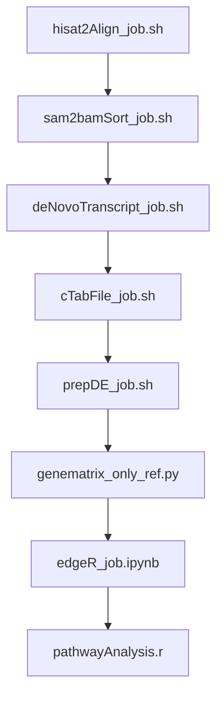

# RNA-Seq-Eukaryote

## Author Inder Raj Singh
## contact irsingh@ncbs.res.in

This repository contains the scripts for running DGE and pathway anaylsis for eukaryote RNA sequence data.

|Env|Script|
|---|---|
|codingEnv| genematrix_only_ref.py (only required for pandas package)|
|rnaSeqEnv| hisat2Align_job.sh, sam2bamSort_job.sh|
|stringtieEnv| cTabFile_job.sh, denovoTranscript_job.sh, prepDE_job.sh|

### Order of script execution

