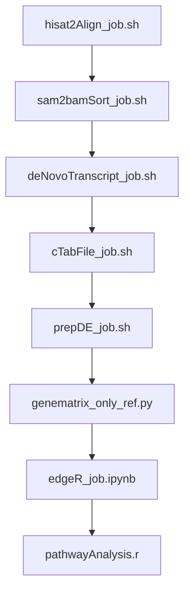

# RNA-Seq-Eukaryote

# Author Inder Raj Singh
# contact irsingh@ncbs.res.in

This repository contains the scripts for running DGE and pathway anaylsis for eukaryote RNA sequence data.

```mermaid
graph TD
A[hisat2Align_job.sh]-->B[sam2bamSort_job.sh]
B-->C[deNovoTranscript_job.sh]
C-->D[cTabFile_job.sh]
D-->E[prepDE_job.sh]
E-->F[genematrix_only_ref.py]
F-->G[edgeR_job.ipynb]
G-->H[pathwayAnalysis.r]
```