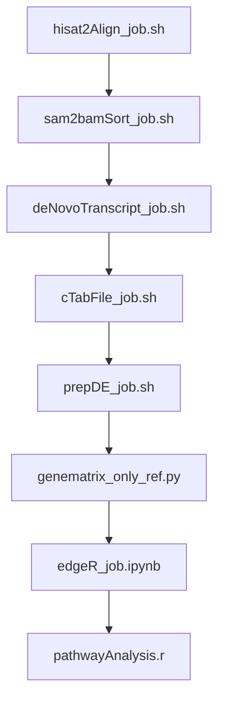

# RNA-Seq-Eukaryote

## Author Inder Raj Singh
## contact irsingh@ncbs.res.in

This repository contains the scripts for running DGE and pathway anaylsis for eukaryote RNA sequence data (for paired end).

|Env|Script|
|---|---|
|codingEnv| genematrix_only_ref.py (only required for pandas package)|
|rnaSeqEnv| hisat2Align_job.sh, sam2bamSort_job.sh|
|stringtieEnv| cTabFile_job.sh, denovoTranscript_job.sh, prepDE_job.sh|

### Order of script execution

## Input 
1. hisat2Align_job.sh : 
    1. FastQsampleList File - the .txt file which contain the fastq sample list seperated by newline character, sample ID should be same for example if two sample XYZ_R1.fastq XYZ_R2.fastq then the file should contain only XYZ.
    2. GTF File
    3. Output Folder for hisat index
    4. Output Folder for Sam Files
    5. Number of cores to used for parallel (default 15)

2. sam2bamSort_job.sh
    1. Input folder containing samfiles
    2. Output folder for bam files 

3. deNovoTranscript_job.sh :
    1. GTF File
    2. output folder for denovo transcript gtf file
    3. Bam file folder
    4. Name of the merged transcript file
    5. Number of cores to used for parallel (default 15)

4. cTabFile_job.sh
    1. Bam file folder
    2. Merged transcript file from previous script
    3. Output folder for the transcript abundances and counts table
    4. Number of cores to used for parallel (default 15)

5. prepDE_job.sh
    1. Input folder containg the transcript abundances and table 
    2. OutputFolder for the raw read count per gene matrix.

6. genematrix_only_ref.py (option script run if you are not interested int noval gene/transcript which are not present in reference annotation file)
    1. raw read count per gene matrix

7. edgeR_job.ipynb
    1. Raw read count matrix

8. pathwayAnalysis.r
    1. CPM file
    2. pathway file from gsea
    3. Output file name
